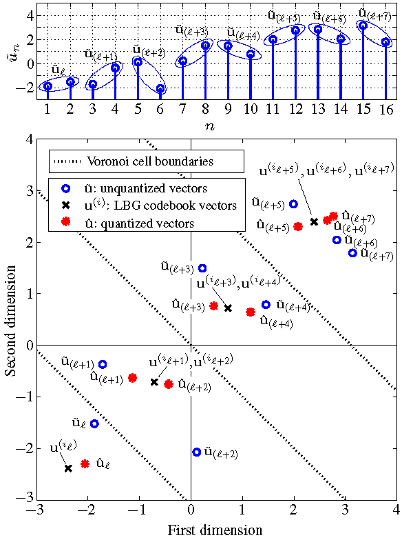

I am currently a PhD student at the [Institute for Communications Technology](https://www.ifn.ing.tu-bs.de/en/ifn/), Technische Universität Braunschweig, Germany. My research fields include **transcoded** (i.e., after encoding and decoding) **speech enhancement**, **deep learning methods**, and **robust speech and audio decoding**. [Here](https://www.ifn.ing.tu-bs.de/en/ifn/sp/zhao/) is my homepage in the university. 

I will briefly introduce my publications and the related research work here. 

##  Publications
- Nonlinear Prediction of Speech by Echo State Networks

  **Ziyue Zhao**, Huijun Liu, Tim Fingscheidt

  _European Signal Processing Conference (EUSIPCO), Sept. 2018_
 
  Abstract: Speech prediction plays a key role in many speech signal processing and speech communication methods. While linear prediction of speech is well-studied, nonlinear speech prediction increasingly receives interest especially with the vast amount of new neural network topologies proposed recently. In this paper, nonlinear speech prediction is conducted by a special kind of recurrent neural network not requiring any training beforehand, the echo state network, which adaptively updates its output layer weights. Simulations show its superior performance compared to other well-known prediction approaches in terms of the prediction gain, exceeding all baselines in all conditions by up to 8 dB.
  
- Improving Vector Quantization-Based Decoders for Correlated Processes in Error-Free Transmission [[paper]](https://www.researchgate.net/profile/Ziyue_Zhao/publication/309321915_Improving_Vector_Quantization-Based_Decoders_for_Correlated_Processes_in_Error-Free_Transmission/links/5809eec908ae3a04d624f3aa.pdf) [[poster]](https://www.researchgate.net/profile/Ziyue_Zhao/publication/309321915_Improving_Vector_Quantization-Based_Decoders_for_Correlated_Processes_in_Error-Free_Transmission/links/5809eec908ae3a04d624f3aa.pdf)

  **Ziyue Zhao**, Sai Han, Tim Fingscheidt

  _ITG Conference on Speech Communication, Oct. 2016_

  Abstract: Low bit rate vector quantization (VQ) is omnipresent in today’s media transmission. With IP-based transmission the situation is that source-coded bits are typically either lost/deleted as a whole frame/packet, or they are received correctly. Assuming correctly received VQ symbols we show how to exploit vector-to-vector (i.e., residual temporal) redundancy at the decoder side for an improved reconstruction. It turns out that a feedforward neural network is an effective means for predicting better reconstruction vectors at the receiver in a system-compatible fashion, gaining up to 1 dB SNR depending on signal correlation and bit rate.

